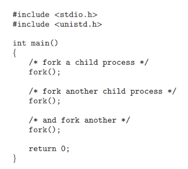
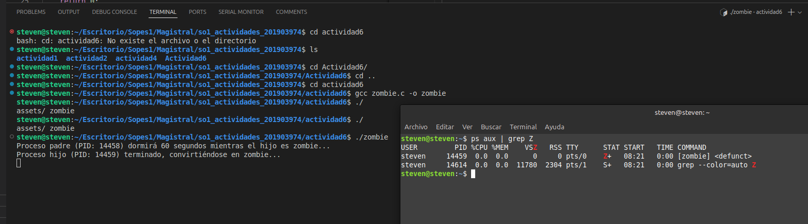
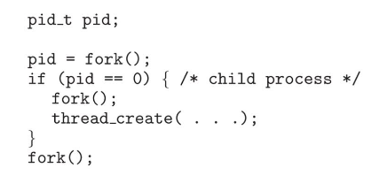

### Steven Josue González Monroy    -   201903974

# Actividad 6

## 1. ¿Incluyendo el proceso inicial, cuantos procesos son creados por el siguiente programa?
Razone su respuesta.



* Cada vez que se llama a fork() el proceso actual se duplica, creando un proceso hijo. Entonces en el código anterior como fork es llamado 3 veces en el mismo proceso principal podemos calcular el numero de procesos usando la formula 2^n, sustituyendo n por el numero 3.

Entonces, incluyendo el proceso inicial, el progrma crea 8 procesos.

---

## 2. Utilizando un sistema Linux, escriba un programa en C que cree un proceso hijo (fork) que finalmente se convierta en un proceso zombie. Este proceso zombie debe permanecer en el sistema durante al menos 60 segundos.
Los estados del proceso se pueden obtener del comando: ps -l

```c
#include <stdio.h>
#include <unistd.h>
#include <sys/types.h>
#include <sys/wait.h>
#include <stdlib.h>

int main() {
    pid_t pid = fork();

    if (pid < 0) {
        // Error al crear el proceso
        perror("fork");
        exit(1);
    } else if (pid == 0) {
        // Proceso hijo
        printf("Proceso hijo (PID: %d) terminado, convirtiéndose en zombie...\n", getpid());
        exit(0);
    } else {
        // Proceso padre
        printf("Proceso padre (PID: %d) espera 60 segundos mientras el hijo es zombie...\n", getpid());
        sleep(60);
        wait(NULL);
    }

    return 0;
}
```

* Al compilar y ejecutar el código anterior podemos apreciar el comportamiento de los procesos padre e hijo.



---
## 3. Usando el siguiente código como referencia, completar el programa para que sea ejecutable y responder las siguientes preguntas



* ## ¿Cuántos procesos únicos son creados?

    * Proceso inicial main
    * Promer `fork()`: crea un proceso hijo
    * Dentro de ese huijo se llama a otro `fork()`: Crea un proceso hijo
    * Fuera del if del primer hijo llama otro `fork()`: en este caso se duplican los procesos pero solo el principal y el primer hijo, a esto se suma el proceso nieto.

    Por lo tanto ( 1(`main`) + 1(`primer fork`) ) * 2 (`tercer fork`) + 1 (`segundo fork`)  =  **5 procesos**

* ## ¿Cuántos hilos únicos son creados?

    Se crea unicamente un hilo con `pthread_create` dentro del primer proceso hijo. Por lo tanto solo se crea **1 hilo unico**

```C

#include <stdio.h>
#include <unistd.h>
#include <sys/types.h>
#include <pthread.h>
#include <stdlib.h>

void *thread_function(void *arg) {
    printf("Hilo creado (PID: %d)\n", getpid());
    return NULL;
}

int main() {
    pid_t pid;
    pthread_t thread;

    pid = fork();
    if (pid < 0) {
        perror("fork");
        exit(1);
    } else if (pid == 0) {
        // Proceso hijo
        printf("Proceso hijo (PID: %d)\n", getpid());
        
        if (fork() == 0) {  // Segundo fork dentro del proceso hijo
            printf("Proceso nieto (PID: %d)\n", getpid());
        }

        // Crear un hilo dentro del proceso hijo
        if (pthread_create(&thread, NULL, thread_function, NULL) != 0) {
            perror("Error al crear el hilo");
            exit(1);
        }

        pthread_join(thread, NULL);
    }

    // Tercer fork
    fork();

    // Finalización del proceso
    printf("Proceso finalizando (PID: %d)\n", getpid());

    return 0;
}

```